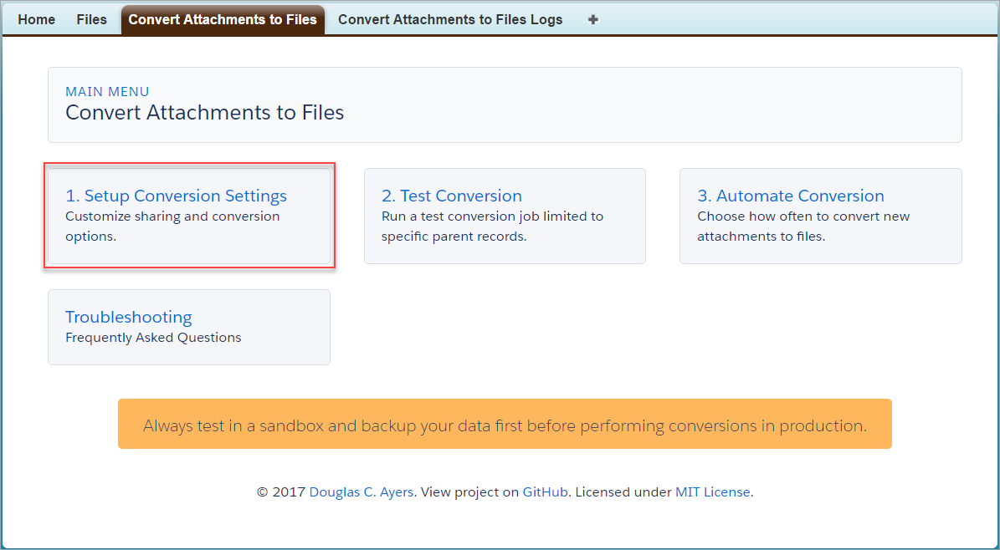
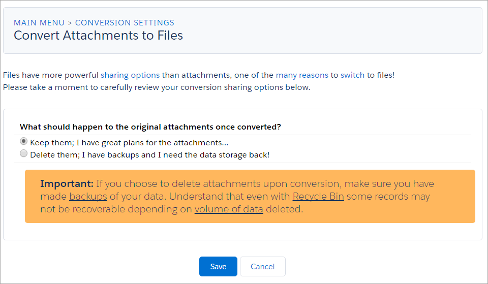

Convert Attachments to Salesforce Files
=======================================

Overview
--------

Salesforce [announced](https://releasenotes.docs.salesforce.com/en-us/spring17/release-notes/rn_files_add_related_list_to_page_layouts.htm) that in **Winter '18**
the "Notes & Attachments" related list will no longer have an upload or attach button. Customers will be required to migrate to and adopt Salesforce Files.

At the time of this project, Salesforce has not (yet?) provided an official conversion tool from Attachments to Files.

This project enables the manual or automatic conversion of classic [Attachments](https://developer.salesforce.com/docs/atlas.en-us.api.meta/api/sforce_api_objects_attachment.htm)
into [Salesforce Files](https://developer.salesforce.com/docs/atlas.en-us.api.meta/api/sforce_api_objects_contentversion.htm)
to take advantage of more sophisticated features, like sharing, revisions, larger file sizes, etc.

The package includes visualforce pages that let you:
* Configure sharing and conversion options
* Run test conversions
* Enable near real-time or scheduled conversions

Additional Background:
* [Why You Should Add the Files Related List to Your Page Layouts](https://releasenotes.docs.salesforce.com/en-us/spring17/release-notes/rn_files_add_related_list_to_page_layouts.htm)
* [Add the Files Related List to Page Layouts](http://docs.releasenotes.salesforce.com/en-us/winter16/release-notes/rn_chatter_files_related_list.htm)
* [5 Reasons to Use Files Related List](https://admin.salesforce.com/5-reasons-use-files-related-list)
* [Chatter Files: A Better Option for Attaching Files to Records](https://www.salesforce.com/blog/2012/04/chatter-files-a-better-option-for-attaching-files-to-records.html)
* [ContentVersion Documentation](https://developer.salesforce.com/docs/atlas.en-us.api.meta/api/sforce_api_objects_contentversion.htm)

Installation
------------

* Managed Package ([production](), [sandbox]())
* [Deploy from Github](https://githubsfdeploy.herokuapp.com) (unmanaged, only if you intend to customize the conversion logic and be responsible for unit tests)

Getting Started
---------------

1. Enable setting [Create Audit Fields](https://help.salesforce.com/articleView?id=Enable-Create-Audit-Fields) so Attachment create/update/owner fields can be preserved on the new files
2. Enable setting [Files uploaded to the Attachments related list on records are uploaded as Salesforce Files, not as attachments](https://releasenotes.docs.salesforce.com/en-us/spring16/release-notes/rn_files_notes_attachments_list.htm)
3. Add "Files" related list to your page layouts (e.g. Accounts, Contacts, Tasks, Events, etc.)
4. Deploy the package using one of the installation links above
5. Assign yourself the permission set **Convert Attachments to Files** then switch to the app by the same name
6. On the **Convert Attachments to Files** tab page, click on **Setup Conversion Settings** to configure sharing and conversion behavior
7. Perform a **test** conversion
8. Consider **automating** conversion

FAQ
===

Max Documents or Versions Published Governor Limit
--------------------------------------------------
When converting classic Notes & Attachments the new data is stored in the `ContentVersion` object.
There is a [limit to how many of these records can be created in a 24 hour period](https://help.salesforce.com/articleView?id=limits_general.htm&language=en_US&type=0).
If you have a lot of Notes & Attachments to convert plan around this limit and split the work across multiple days.

Field is not writeable: ContentVersion.CreatedById
--------------------------------------------------
When you deploy the package you might get error that files are invalid and need recompilation and one of the specific messages
might say "Field is not writeable: ContentVersion.CreatedById". The conversion tool tries to copy the attachment's original
created and last modified date/user to the converted file. To do so then the "Create Audit Fields" feature must be enabled.
Please see [this help article](https://help.salesforce.com/articleView?id=Enable-Create-Audit-Fields) for instructions enable this feature.

Are there any objects that don't support attachment conversion?
---------------------------------------------------------------
Yes, the [EmailMessage](https://developer.salesforce.com/docs/atlas.en-us.api.meta/api/sforce_api_objects_emailmessage.htm) object.
Although technically you can convert their attachments to files, you cannot **share** the files to the email message records.
You will receive error `INSUFFICIENT_ACCESS_OR_READONLY, You can't create a link for Email Message when it's not in draft state.: [LinkedEntityId]`.

How are private attachments converted?
--------------------------------------
Classic Notes & Attachments have an [IsPrivate](https://help.salesforce.com/apex/HTViewHelpDoc?id=notes_fields.htm) checkbox field that when selected
makes the record only visible to the owner and administrators, even through the
Note or Attachment is related to the parent entity (e.g. Account or Contact).
However, ContentVersion object follows a different approach. Rather than an
explicit 'IsPrivate' checkbox it uses a robust sharing model, one of the reasons
to convert to the new Files to begin with! In this sharing model, to
make a record private then it simpy isn't shared with any other users or records.
The caveat then is that these unshared (private) Files do not show up
contextually on any Salesforce record. By sharing the new File with the
original parent record then any user who has visibility to that parent record now
has access to this previously private attachment. Therefore, when converting
you have the option to specify whether the private attachments should
or should not be shared with the parent entity once converted into new File.

If I run the conversion multiple times, do duplicate files get created for the same attachments?
------------------------------------------------------------------------------------------------
No, no duplicate files should be created once an attachment has been converted once.
When attachments are converted into files we store the `Attachment.ID` in the `ContentVersion.Original_Record_ID__c` field for tracking purposes.
The conversion logic first checks if there exist any files that have been stamped with the attachment id, if yes then we skip converting that attachment again.

Of course, if you choose the conversion option to delete the attachments upon conversion then no such attachment would exist the second time around.
But if you choose to keep the attachments post conversion they will not be converted again if you run conversion process multiple times.

Disclaimer
==========

This is not an official conversion tool by salesforce.com to migrate Attachments to Salesforce Files.
This is a personal project by [Doug Ayers](https://douglascayers.com) to assist customers in migrating to and adopting Salesforce Files.
Although this tool has been successfully tested with several customers since 2015 that have
between dozens to tens of thousands of attachments, please do your own due diligence
and testing in a sandbox before ever attempting this in production.

Always make a backup of your data before attempting any data conversion operations.

You may read the project license [here](https://github.com/DouglasCAyers/sfdc-convert-attachments-to-chatter-files/blob/master/LICENSE).

Special Thanks
==============

* [Arnab Bose](https://www.linkedin.com/in/abosesf/) ([@ArBose](https://twitter.com/ArBose)), Salesforce Product Manager
* [Haris Ikram](https://www.linkedin.com/in/harisikram/) ([@HarisIkramH](https://twitter.com/HarisIkramH)), Salesforce Product Manager
* [David Mendelson](https://www.linkedin.com/in/davidmendelson/), Salesforce Product Manager
* [Rick MacGuigan](https://www.linkedin.com/in/rick-macguigan-4406592b/), a very helpful early adopter and tester!
* And to everyone who has provided feedback on this project to make it what it is today, thank you!
